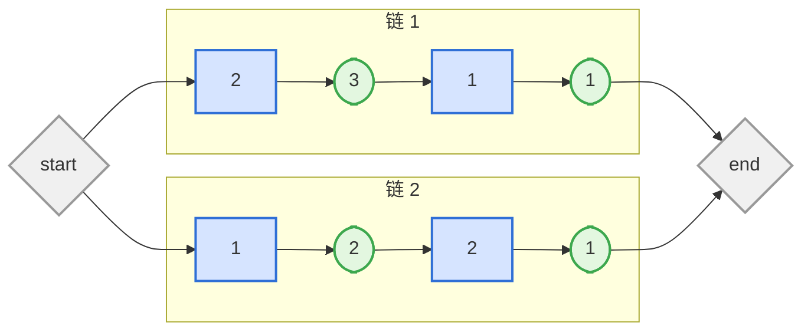
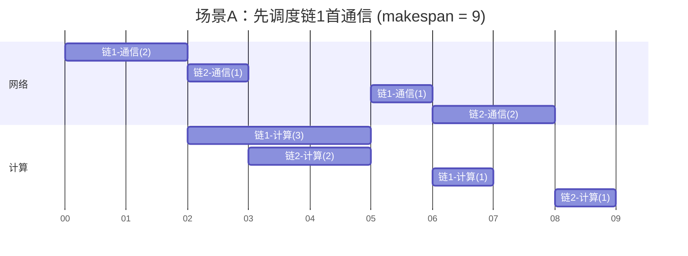
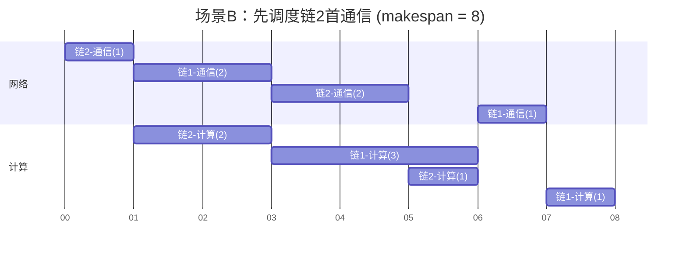

## Roadmap

LLM training流量调度思路：
1. **DAG-semantic-instructed flow scheduling**
	根据对DAG结构的分析，识别出那些对于任务整体进度比较关键的流，优先完成它们来优化makespan / 提升通信计算overlap
2. **Runtime-adaptive flow scheduling**
	在训练过程中，每隔一段时间将以完成的DAG节点移除，对剩余图重计算新的schedule，从而能够让得到的plan能够对任务DAG的动态变化做出反应

DAG-semantic 分析路线： 
- [ ] 针对某些简化的DAG结构，分析出全局最优的调度策略；
- [ ] 对于一般情形的问题，进行形式化建模，思考其复杂性；
- [ ] 根据问题的NP-hardness，决定是采取heuristic算法还是全局最优求解；
- [ ] 最终目标是得出一个适用于general DAG情形的，决定流量带宽分配或者优先级顺序的静态分析算法；

Runtime-adaptive 实现路线：
- [ ] 研究已有的 flow scheduler在Megatron等training framework中的实现方式
- [ ] 具体的实现机制有待进一步研究
- [ ] 最终目标是将上面的DAG静态分析算法，转化为一个对动态变化做出反应的adaptive版本，并且实现在framework层

## DAG 调度形式化分析

1. 任务依赖DAG
	 - $G=(V,E)$，包含通信+计算两类节点。
	 - 通信节点有一个bytes属性（后续记作$b$）代表传输字节数；计算节点有一个latency属性（后续记作$p$）代表计算所需时间；
	 - 有向边代表任务依赖关系，被指向的节点必须在前面的节点完成后才能开始；
2. 通信模型
	- 作为问题简化的一部分，我们将网络视为单channel模型，具有整体容量C，所有并发的通信任务竞争这些带宽；
	- 通信节点的执行时间等于 $b/r$，其中$r$指的是该节点分配到的平均带宽；
	- 暂时忽视网络拓扑与任务依赖图之间相互作用的复杂性。适用于网络中具有单瓶颈链路的情形，后续可能扩展到多链路；
3. 计算模型
	- 假设计算节点只要满足前置依赖条件后，就可以立即执行（无需等待GPU空闲），且消耗的时间为$p$；
	- 我们主要考虑通信调度而不做计算调度，因此假设GPU上计算任务的执行顺序是预先确定的，这些信息建模到了DAG中；
4. 求解目标
	对于每个通信节点$i$，求解出带宽分配$r_i(t)$，满足：
	1. 网络容量限制：$\forall t,\sum_i r_i(t)\le C$
	2. 通信work完成：$\forall i, \int r_i(t)\mathrm{d}t=b_i$
	3. 依赖约束：对于 $i$ 的所有前驱节点，在它们全部完成之前$r_i(t)=0$
	4. 非负：$r_i(t)\ge 0$

	优化目标 (makespan): $T=max(节点完成时间)$

## 问题分析

> 观察1：上述问题的求解难点在于，未知量为函数，约束非线性，优化目标非线性

解决方法：将该问题拆分为分析部分和组合部分，将函数变量放在分析部分处理，将DAG依赖约束放在组合部分处理，从而去除非线性项

假设通信任务有$n$个，它们的加入和完成顺序为$(\dots,\text{In}_i,\dots,\text{Out}_j,\dots)$，其中这里共有$2n$个事件，每个任务$i$分别有一个In和一个Out事件。这些事件将整个时间轴划分为$2n-1$个phase，在phase k中，同时活跃的任务集合是确定的，记作$S_k$。假设phase k的持续时间为$\Delta_k$。引入一组新的未知数$q_{ki}$，代表任务$i$在phase k传输的字节数。

现在，DAG的依赖关系完全被吸收进事件顺序里了（组合部分），在每个phase内部，约束关系变成如下形式：
1. 网络容量限制：$\forall t,\sum_i r_i(t)\le C$
2. 通信work完成：$\forall i, \int_{\Delta_i} r_i(t)\mathrm{d}t=q_{ki}$
3. phase事件约束：
	- 若phase k的结束事件为$\text{Out}_j$，则需要满足$\sum_{l\le k}q_{kj}=b_j$
	- 若phase k的结束事件为$\text{In}_i$，则对于所有$i$在DAG中的直接前驱通信节点$j$，满足$\sum_{\text{out}_j}^k\Delta_l\ge \text{lat}(j,i)$，含义是$i$的释放时间不早于每一条$(j,i)$路径的计算延迟
4. 非负：$r_i(t)\ge 0$
优化目标变成$T=\sum \Delta_k$

可以发现，在固定事件顺序并且划分好相应的phase后，**优化问题约束项和目标都变成了线性的，因此可能用LP求解**，唯一的gap在于$r_i(t)$这个函数变量，但是这是很容易去掉的：

> 定理1：存在一个最优调度，带宽分配函数$r_i(t)$是分段常数函数

证明：在phase k中，只需要取$r_i=q_{ki}/\Delta_i$进行平均化即可，可以证明替换之后的调度仍然满足所有约束条件，且makespan不增；

后续只考虑按照phase分段常数的解，并且进行变量替换$r_{ki}$表示phase k，任务i分得的带宽，并且将约束条件1（网络容量限制）替换成
$$
\forall k,\sum_i r_{ki}\le C
$$
也即：
$$
\sum_i q_{ki}\le C{\Delta_k}\tag{C1}
$$

> 定理2：存在一个**极化**调度是最优的，在每个活跃任务集合$S_k$非空的phase中，只有一个任务分得全部带宽$C$，其余任务分得0带宽；

证明略，可以通过反证法+交换调度时间片来严格证明；

直观理解：网络容量限制条件C1决定的可行域是一个多棱椎体，其余条件也均为线性约束，因此问题可行域是多棱锥在一个仿射子空间的截面，是一个单纯形。线性优化目标必定有最优值在单纯形的顶点取到，而所有顶点都位于原棱椎的棱上，这些棱对应某个$r_{ki}=C$而其余$r_{kj}=0$的分配方案。

解释：这一定理表明，在单瓶颈链路场景，**分裂带宽的调度并不会得到更优的makespan**，完全可以让某个任务占据全部带宽，直到它跑完或者有新任务加入。这表明在流量调度机制的选择上，简单的priority queue已经足够好，不必引入weighted fairness queue来进行精细带宽分配控制。

*与Coflow调度场景Sincronia (sigcomm 18) 的 "ordering is enough"的直觉是一样的*

> 观察2：经过以上分析步骤，最小化makespan的问题已经成功拆分为一个“确定任务进出顺序”的组合问题，和一个“决定每个phase带宽分配”的LP问题。

其中LP问题是多项式时间可解的，且有成熟的计算框架。对于任务进出顺序，如果暴力枚举，会有$n!$量级的组合方式，可见问题的困难主要集中在组合部分。不幸的是，它确实是NP-hard的。

为了说明这一点，我们首先考虑一个简化的子问题：其中，DAG的结构是由多条parallel链组成，并在首尾分别增加一个执行时间为0的扇出节点和一个汇入节点。因此DAG的makespan等于最长链的执行时间。

**Motivating Example:** 蓝色 = 通信，绿色 = 计算，数字为bytes或者计算时间，网络容量C=1



**调度方案A：优先调度链1首通信任务 → makespan = 9**



**调度方案B：优先调度链2首通信任务 → makespan = 8**



可以发现，直觉上认为合理的critical-path-first的调度顺序（方案A）反而得到了更长的makespan。这表明，即使是在最简化的平行链情形下，puppeteer的cirtical-path-first策略也不是最优的。

在研究这个简单情形问题的过程中，曾经认为可能得到最优调度的几种顺序，最终也被AI发现反例：
1. longest-tail-first：对每个任务计算所在链的尾延时，从高到低调度；
2. 基于下游通信-计算比例排序，从高到低调度；
3. Horn max-flow构造算法：基于makespan下界$T^{*}=\max_q\{q + W_{≥q}/C\}$，构造 (时间区间， 通信需求)图，求解最最大流，转换成具体的调度方案；这种方法来源于某些经典的单机调度场景，但在我们的场景中被证明下界不是紧的因此构造算法也失效。

在多次尝试后，发现问题的关键在于如何最大化网络-计算两种资源的overlap，例如方案A中3~5s出现2s的通信空洞，而方案B中通过调换顺序相应的空洞移动到了5~6s变成1s，这是省下来的1s makespan关键来源。直觉上看这是一个组合问题，需要合理调整链的执行顺序以便让某条链上的通信空洞被其它链的任务填满。


> 定理3：单链路场景下，对于由n条平行链组成的DAG，最小化makespan的调度问题是NP-hard的。也即存在NP难的问题可以规约到它。

规约起点是Yu et.al在2004年已经证明NP-hard的一类问题，两阶段flow-shop + 阶段间含delay + 两道工序均为单位执行时间；

可以证明它可以规约到多平行链DAG调度的一个子问题，一共有n条链，每条链上只有两个通信任务，中间夹着一个计算任务；

> 结论：

1. 带宽分配并不是问题困难性的关键，在已知全局进出排序的情况下，完全可以用priority调度来得到最优makespan；
2. 任务进出的全局排序是NP-hard的来源，而这个排序的困难性源于两方面，其一是DAG结构的复杂性导致合法排序集合很难确定，其二是在可行排序中找出能最优化通信-计算overlap的也很难；
3. 即使刨除DAG结构本身的复杂性，只考虑多链并行的简单依赖关系，如何选择下一个任务进行调度（等价于从n条链中选取下一步推进的链），这个问题都已经是NP-hard了；
4. 因此只能退而求其次考虑heuristic-based的调度方法；

## 接下来的计划

分两条路线并行：
1. DAG-调度heuristic探索（policy）
	- Start point：上面已经讨论过的 longest-tail-first、通信-计算比、Horn算法；
	- 验证手段：手动构造简单DAG+从1F1B / ZeroBubble等并行模式下导出实际DAG，在这些DAG下验证各种调度heuristic的效果。对于小的DAG可以通过暴力枚举求最优解与heuristic解进行比较；
	- 目标：得出一个有充足的直觉来说明为何能work，且在实际DAG下能够表现较好的调度heuristic；
2. Runtime-adaptive 实现路线（mechanism）
	- 考虑如何在megatron等已有框架中实现某种动态重调度的机制；


## 会后补充部分（关于DAG调度heuristic）

> longest-tail first调度策略

该策略来源于单机-最小化最大延迟 ($1\| L_{\max}$) 问题的 Jackson 规则。其核心思想是：在所有尚未完成的作业中，优先安排截止时间最早者执行——即“最早截止时间优先”（Earliest Due Date First, EDD）

在多并行链DAG场景，对于链 $c_1\to l_1\to\dots\to c_n\to l_n$，其中$c_i$为第$i$个通信任务，其字节数也用相同符号代表，$l_i$为第$i$个计算任务，其耗时也用相同符号代表；

定义尾部时延 $q(c_n)=l_n$，$q(c_i) = q(c_{i+1})+l_i+c_i/C$，本质上就是该通信任务所在链，其后任务的最短执行时间；

调度规则：
1. 将当前时间能够释放的通信任务加入活跃集合$S$;
2. 在$S$中选取尾部时延最长者开始执行，若有多个，任取一个进行调度；
3. 持续步骤2直到调度的任务执行完，或者有新任务前置条件满足而加入到$S$中；这时重新进行新一轮步骤2；

>变种：最长剩余处理时间LRPT（Muntz-Coffman调度算法）

与上面基本相同就是多考虑的任务本身的剩余处理时间；

定义剩余处理时间$s(c)=q(c)+r(c)/C$，其中尾部时延$q(c)$定义如上，$r(c)$表示在调度决策时刻$c$剩余的字节数;

调度规则：
1. 将当前时间能够释放的通信任务加入活跃集合$S$;
2. 在$S$中选取尾部时延最长者开始执行，若有多个，则均分资源同时推进它们；
3. 持续步骤2直到某个被调度的任务执行完，或者有新任务前置条件满足而加入到$S$中，或者在执行过程中它们的剩余处理时间降至与S中其它某个未被调度的任务相等；此时重新进行新一轮步骤2；

> Horn 算法

Horn算法是一类针对 “有就绪时间 `r_i`、处理时间 `p_i`、截止期 `d_i`的一组任务 i，且允许抢占/切分” 任务场景的算法。原始算法考虑的是一组独立没有依赖的任务。

在我们的多并行链DAG场景中，可以利用上述尾部时延$q(c)$对截止期进行乐观估计；用类似的方法可以估计就绪时间（链前面的任务乐观完成时间）；

Horn algorithm（adapt到我们的任务链场景）

Input：目标总时间 T，一组任务链

Output：T是否可行，并且在可行时给出一组makespan为T的调度

Step：
1. 对每个任务$i$计算上游链长度$r_i$以及尾部链长度$q_i$，则截止时间$d_i=T-q_i$；
2. 最大流网络构造。
	- 将\[0,T\]区间以所有$r_j,d_j$为断点切分，得到一系列小段\[$s_{k-1}$,$s_k$\]，记$s_k-s_{k-1}=\Delta_k$；
	- 源节点S，每个任务一个节点$J_i$，每个小段一个节点$I_k$，汇节点D；
	- 边 $S \to J_i$：容量 $w_i$（这个 job 的总工作量，例如我们场景中的通信字节数）
	- 边$J_j \to I_k$：容量 ∞，**仅当** job 的窗口 \[r_i, d_i\] 完全包含该段
	- 边$I_k \to D$：容量 $C·Δ_k$（带宽 × 时长）
3. 求解最大流
4. 可行性判断：可行 ⟺ 最大流 = $\sum w_j$（饱和）。不饱和 = 有工作装不进任何合法时段。（注意这里可行性充要条件针对原问题的，我们的链式依赖场景中可能有假阳性）
5. 在可行时，从最大流中获取具体调度安排：
	- 流边 $J_i \to I_k$ 上的流量 $x_{ik}$ 的含义：job i 有 $x_{ik}$ 的工作量在时段 k 内处理；
	- 每一段中按照任意顺序安排job i 的$x_{ik}$工作量；

定理：T可行的一个必要条件（对于$r_i$,$d_i$固定的原问题也是充分条件）
$$
\forall a\le b, \sum_{r_i\ge a, d_i\le b}w_i\le C(b-a)
$$
必要性很显然，含义就是只能在\[a,b\]区间内完成的任务，总工作量必须小于容量×区间长度；（原问题的）充分性可以从上面构造的网络的最小割得出（$W_{ab}:=\sum_{r_i\ge a, d_i\le b}w_i$）：
$$
\text{min-cut}=\sum w_j-\max_{a\le b}(W_{ab}-C(b-a))
$$
因此，可行 ⟺ 最大流 = $\sum w_j$ ⟺ $\max_{a\le b}(W_{ab}-C(b-a))=0$

推论：特别的，取$a=0$时得到 $\forall b,\sum_{d_i\le b}w_i\le Cb$，代入$d_i=T-q_i$得到T的一个下界：
$$
T^{*}=\max_s\{s+\frac {W_{q_i\ge s}}{C}\}
$$

注意，存在反例，使上述算法的可行性判断中出现假阳性，也即虽然最大流条件满足但是仍然不存在相应的调度，例如：
```
链 A: A1(1) --计算lag 1--> A2(1) --计算lag 0--> A3(1)
链 B: B1(1) --计算lag 3--> B2(1) --计算lag 0--> B3(1)
```

T=6时，最大流存在，对应的时间片调度为：
```
[0,1]: B1
[1,2]: A1
[2,3]: A2
[3,4]: A3
[4,5]: B2
[5,6]: B3
```

但并不合法，原因是前面任务的延迟导致乐观估计的\[$r_i$,$d_i$\]窗口失效；

> 后续可以做的事情：

1. 对于简化的并行链DAG，探索伪多项式时间算法，例如与T有关的dp / 二分查找等；
2. 研究现有调度heuristic的表现，看看有无可能有常数近似比；
3. 找一些新的heuristic，目标是最小化makespan，得出的调度规则最好能有比较好的直觉
4. 小规模验证：初期探索阶段可以自己手动构造小的DAG，尝试画任务时间线，结合现有策略的失效场景，看看能否得出一些新的想法；
5. LLM training实例分析：观察实际workload的DAG结构，也许在特定的结构下存在更符合直觉甚至是能达到最优的调度方法；
	- 目前我觉得training DAG的关键复杂度来源于PP的调度顺序，其余几个并行维度的流量依赖关系其实比较简单（如果不考虑复杂的collective communication算法的话）
	- 之前已经实现了1f1b、zerobubble、dualpipe之类的PP策略，可以手画或者从模拟器导出相应的DAG结构，进行人工观察，辅助算法设计；
	- 假设并行维度相互独立，training DAG其实相当于各自维度内DAG的笛卡尔积，也许这种拆分能带来一定的复杂度简化，关键问题就是要考虑不同维度间的重叠流量


> 一些参考文献

- (Horn算法原始论文) SOME SIMPLE SCHEDULING ALGORITHMS, W. A. Horn, 1971
- (用于NP-hard规约的两阶段flow shop问题) MINIMIZING MAKESPAN IN A TWO-MACHINE FLOW SHOP WITH DELAYS AND UNIT-TIME OPERATIONS IS NP-HARD, Journal of Scheduling 7: 333–348, 2004
- (两阶段flow shop问题的另一篇，里面有一些heuristic，例如longest delay, first fit) Scheduling two-phase jobs with arbitrary time lags in a single-server system, IMA Journal of Mathematics Applied in Business & Industry (1993/4) 5, 143-161
- (这里面有个LLM training DAG调度的heuristic策略可以参考，与上面的问题最为相关) Tictac: Accelerating distributed deep learning with communication scheduling. Proceedings of Machine Learning and Systems, 1:418–430, 2019
