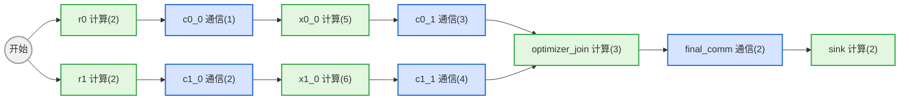
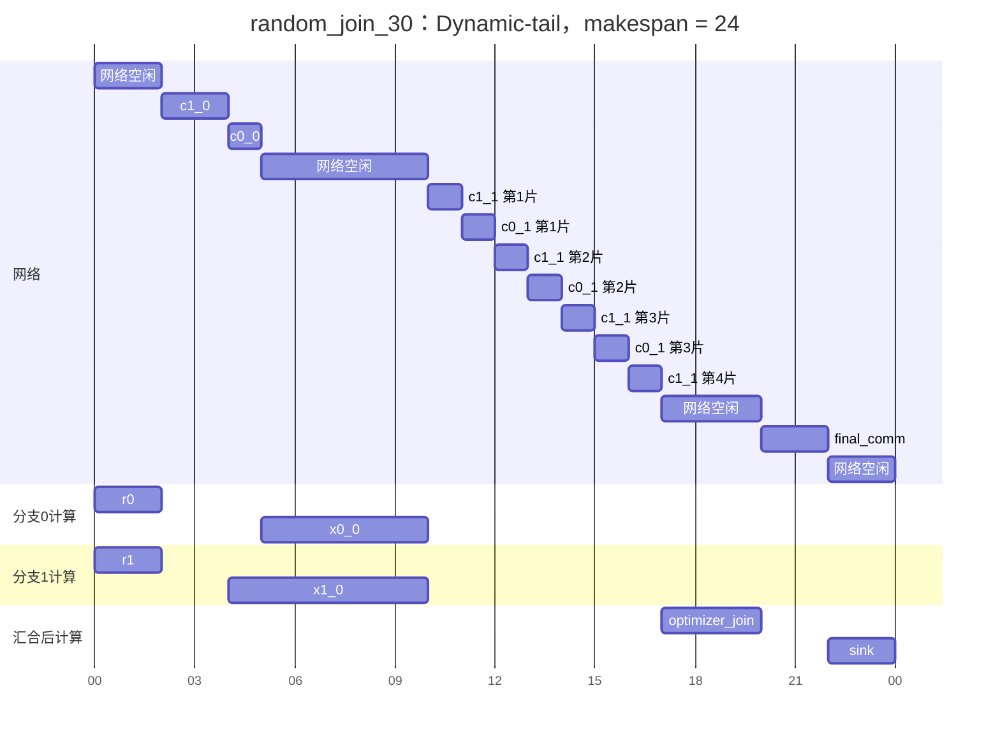
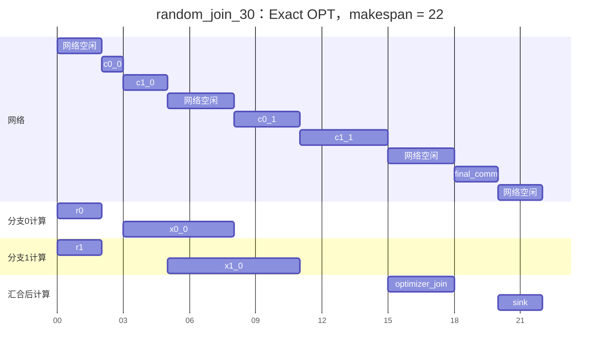
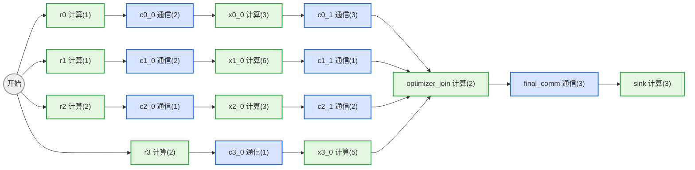
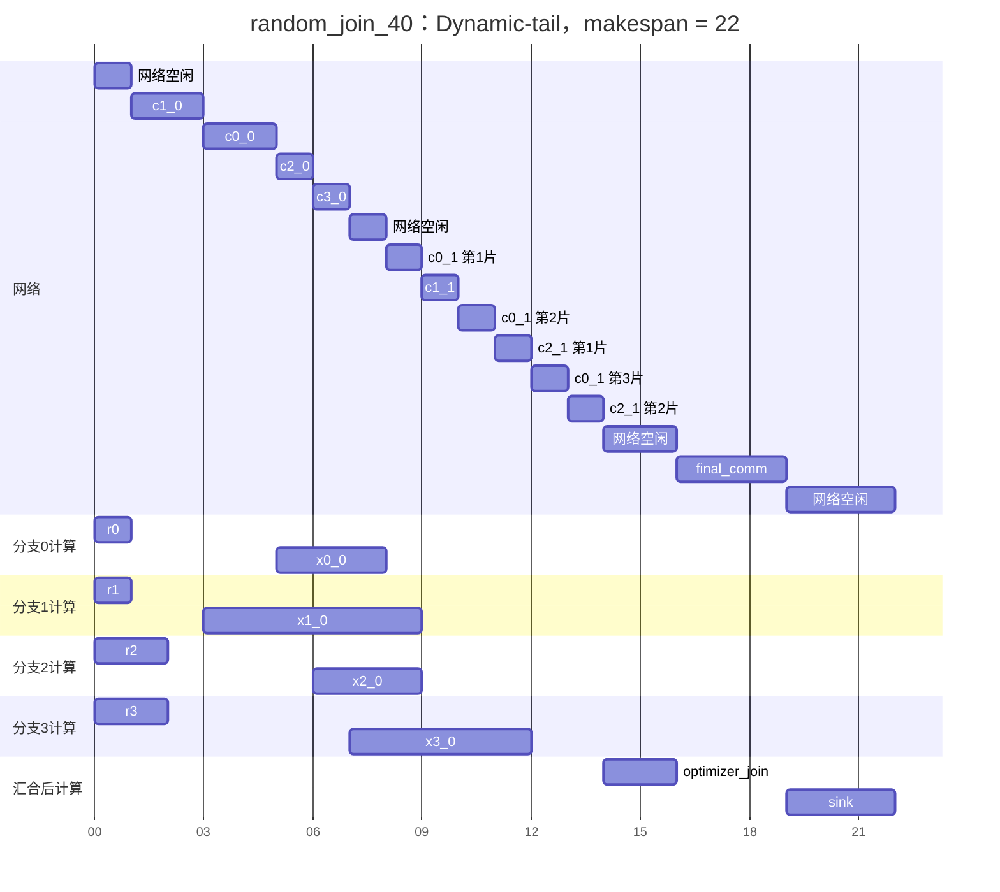
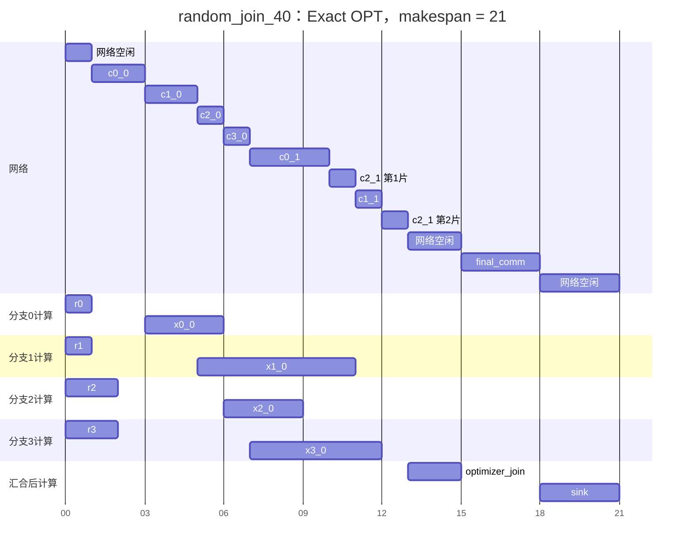
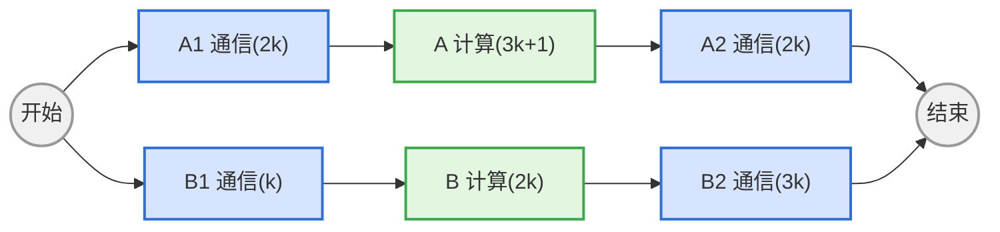
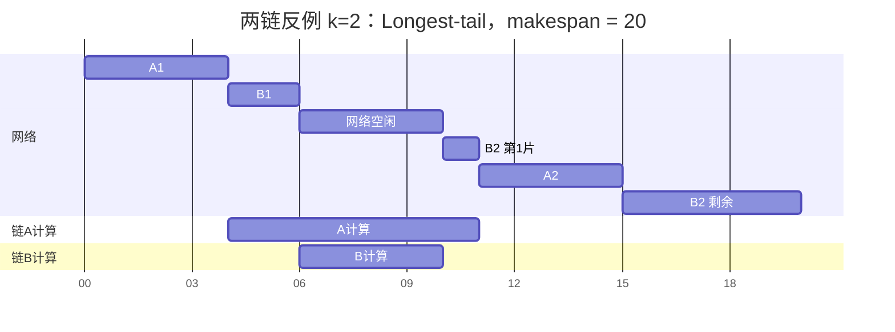
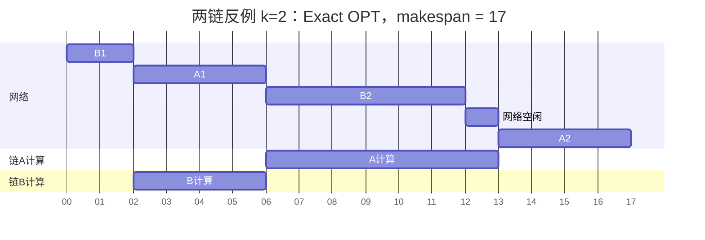

# Dynamic-tail 调度反例

本文把单 channel 实验中 Dynamic-tail 没有达到精确最优的代表性实例画出来。图和时间线使用与 `260804组会.md` 相同的约定：

- 蓝色节点是通信任务，括号内为通信时间；
- 绿色节点是计算任务，括号内为计算时间；
- 单 channel 容量归一化为 1，同一时刻只能推进一条通信；
- 不同分支的计算可以并行；
- 时间单位是 benchmark 的离散时间量子，不代表固定的微秒数；
- Gantt 图中的 `网络空闲` 表示此时没有 ready communication，并非调度器主动 idle。

本文重点展示三个例子：

| 反例 | Dynamic-tail | OPT | 比值 | 主要失败原因 |
|---|---:|---:|---:|---|
| `random_join_30` | 24 | 22 | 1.0909 | 先启动最长计算分支，导致两条第二段通信同时释放 |
| `random_join_40` | 22 | 21 | 1.0476 | 没有为稍后出现的通信波次预留可填充的工作 |
| 可缩放两链族，`k=2` | 20 | 17 | 1.1765 | Tail 的局部优势诱导错误的连续投资，最坏比渐近趋向 `5/4` |

前两个是 `seed=260817` 的 73 个一般 DAG exact suite 中 Residual Dynamic-tail 唯二没有达到最优的实例。第三个是理论反例族，用来说明高经验最优率不能转化为小于 `5/4` 的一般保证。

## 一、反例 `random_join_30`

### 1. DAG 结构

这个图有两条分支。两条分支的第二段通信全部完成后，才能进入 optimizer join、最终通信和 sink 计算。



### 2. Dynamic-tail 为什么首先选择 `c1_0`

时间 `t=2` 时，两条首通信同时 ready。忽略当前 flow 自身，两个 downstream tail 为：

$$
q(c0\_0)=5+3+3+2+2=15,
$$

$$
q(c1\_0)=6+4+3+2+2=17.
$$

因此 Dynamic-tail 选择 `c1_0`。这个判断单看一条分支是合理的：`c1_0` 后面确实压着更长的计算和通信。但它没有考虑一个组合后果——如何让两条分支的第二段通信错峰释放。

### 3. Dynamic-tail 时间线：makespan = 24

Dynamic-tail 先传 `c1_0`，再传 `c0_0`：

- `x1_0` 在 `[4,10)` 计算；
- `x0_0` 在 `[5,10)` 计算；
- 两条计算恰好同时在 `t=10` 结束；
- `c0_1` 和 `c1_1` 共 7 个单位通信同时堆到 channel 上；
- 第二段通信直到 `t=17` 才全部完成。



其中第二段通信的逐 tick 交替来自 Dynamic-tail 在 residual state 上不断重算后的确定性选择；交替本身不改变总通信量，真正的问题是两个第二段 flow 都到 `t=10` 才 ready。

### 4. 精确最优时间线：makespan = 22

最优解先选择 tail 较短的 `c0_0`：

- `x0_0` 提前到 `[3,8)`；
- `c0_1` 可以在 `[8,11)` 传输；
- 此时 `x1_0` 正在 `[5,11)` 计算，通信与计算完全重叠；
- `x1_0` 结束时立刻传 `c1_1`，第二段通信在 `t=15` 全部完成。



### 5. 失败原因

Dynamic-tail 只比较：

```text
完成当前 flow 后，哪条分支还剩下更多工作？
```

最优调度实际需要比较：

```text
先启动哪条分支，能让它的下一段通信
填进另一条分支的计算空档？
```

Dynamic-tail 把两条计算的结束时刻同步到 `t=10`，形成 7 单位的集中通信波次；最优解主动让它们在 `t=8` 和 `t=11` 错峰释放，减少 2 单位被迫网络空闲。Next-event counterfactual rollout 能看到这个后果，因此得到 22。

## 二、反例 `random_join_40`

### 1. DAG 结构

这个图有四条并行分支。前三条分支各有两段通信，第四条分支只有首通信和计算。四条分支在 optimizer 前汇合。



### 2. 初始错误选择

时间 `t=1` 时，`c0_0` 和 `c1_0` ready。两者 tail 为：

$$
q(c0\_0)=3+3+2+3+3=14,
$$

$$
q(c1\_0)=6+1+2+3+3=15.
$$

Dynamic-tail 因 1 个单位的 tail 优势选择 `c1_0`。但分支 1 的长计算后只剩一个 1 单位通信；分支 0 的短计算后还有 3 单位通信，更适合作为其它分支计算期内的 network filler。

### 3. Dynamic-tail 时间线：makespan = 22



关键损失发生在 `[7,8)`：四条首通信都已经完成，但 `c0_1` 要到 `x0_0` 在 `t=8` 完成后才 ready；其它后续通信也尚未 ready，所以网络被迫空闲 1 个单位。

### 4. 精确最优时间线：makespan = 21

最优解首先传 `c0_0`，让 `x0_0` 在 `[3,6)` 执行。随后传完其它首通信时，`c0_1` 已经 ready，可以从 `t=7` 立即填满 channel。



### 5. 失败原因

两种方案的通信总量完全相同，最后的 optimizer、final communication 和 sink 也完全相同。唯一差别是最优解消除了 `[7,8)` 的 network hole，使 optimizer 从 `t=14` 提前到 `t=13`，最终 makespan 相应减少 1。

这个反例说明：

> 最长 downstream tail 不一定等于最好的 network-hole filler。一个 tail 略短、但更早释放较大后续通信的分支，可能更值得先启动。

## 三、可缩放的渐近 `5/4` 两链反例

前两个随机图说明 Dynamic-tail 偶尔会损失 1--2 个时间单位。下面的确定性实例族说明这种损失可以随实例等比例放大，不能把有限随机实验的 96%--97% 最优率当作一般保证。

### 1. DAG 结构

对任意整数 `k >= 2`：

```text
链 A：通信(2k) → 计算(3k+1) → 通信(2k)
链 B：通信(k)  → 计算(2k)   → 通信(3k)
```



初始 tail 为：

$$
q(A1)=(3k+1)+2k=5k+1,
$$

$$
q(B1)=2k+3k=5k.
$$

A 只比 B 大 1，因此 Longest-tail 严格选择 A，不依赖 tie-break。

### 2. 取 `k=2` 的 Longest-tail 时间线：makespan = 20

此时：

```text
A：通信4 → 计算7 → 通信4
B：通信2 → 计算4 → 通信6
```



A1 先完成后，A/B 两段计算大部分同步，网络在 `[6,10)` 没有任何 ready flow，产生 4 单位空洞。

### 3. 一个精确最优时间线：makespan = 17

最优方案先完整推进 B1，再推进 A1：



B2 恰好填入 A 的长计算区间，网络空洞从 4 降到 1。一般 `k` 下：

$$
T_{LT}=10k,
$$

$$
OPT=8k+1,
$$

所以

$$
\frac{T_{LT}}{OPT}
=\frac{10k}{8k+1}
\longrightarrow\frac54.
$$

这也是当前 unit-step Rollout-2 和固定宽度 Beam 的反例：

- Rollout-2 只给 B1 一个 tick，随后 Longest-tail 补全又切回 A，看不到“必须连续完成 B1”的长期收益；
- Beam-`B` 要连续保留推进 B1 的分支 `k` 层，取 `k>B` 后，该分支会被当前评分裁掉。

需要注意，这一节针对基础并行链 Longest-tail 及其相应 rollout/beam 实现。一般 DAG 的 Residual Dynamic-tail 还有 `gate_gain`、短 flow 和 task-id 的确定性 tie-break；前两节才是当前一般 DAG 实现的直接失败实例。

## 四、三个反例的共同规律

这三个反例表面不同，根本问题相同：

```text
Dynamic-tail 关注单个动作之后“还有多长的关键尾部”；
最优解关注多个分支的通信释放时刻怎样彼此错峰。
```

Tail 是一条路径上的 criticality 指标，没有直接表达：

- 将来哪一时刻会有新的 flow ready；
- 多条 compute lag 是否会同时结束；
- 某条后续通信能否填入另一分支的计算空洞；
- 当前小幅 tail 优势是否值得牺牲未来 release pattern。

这解释了为什么 next-event counterfactual rollout 有效。它不是简单换一个优先级分数，而是对每个候选真正执行到下一个事件，再观察：

```text
新的 flow 何时释放？
网络会不会出现空洞？
join 和最终 makespan 会提前多少？
```

在 `random_join_30/40` 中，Event Rollout-2 分别得到 22 和 21，与 exact OPT 相同。

## 五、复现口径

前两个实例来自：

```text
scripts/study_general_dag_heuristics.py
samples = 50
seed = 260817
```

使用的执行语义为：单个可抢占通信瓶颈、ready compute 立即并行执行、整数 duration、依赖中已包含固定 compute order。Dynamic-tail 和 exact 时间线均由现有模拟状态转移重新生成。

第三个实例由 `scripts/study_parallel_chains.py::scaled_five_four_counterexample(k)` 生成，对应回归测试位于 `tests/test_study_parallel_chains.py`。
